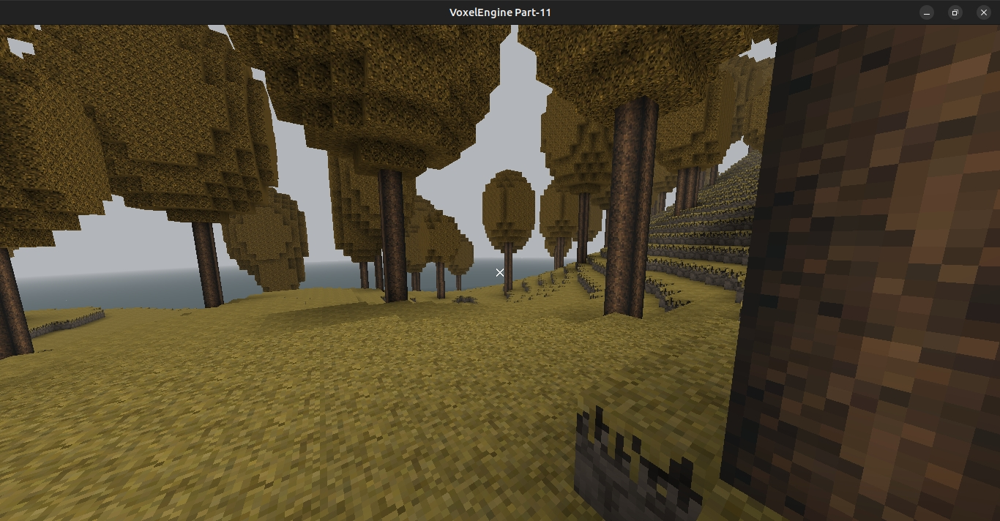

# VoxelEngine

[EXE for windows](https://drive.google.com/file/d/1lkFc5nyYOs0Yyu1wmOoAAwEp4r9jO1tE/view?usp=sharing) 
[MinGW libraries (include & lib) + glew32.dll](https://drive.google.com/file/d/1k1Hnbz2Uhr4-03upt2yHxKws396HQDra/view?usp=sharing)

## Screenshots

## How to build and run in linux

~~~bash
$ cd VoxelEngine
$ mkdir build
$ cd build
$ cmake -DCMAKE_BUILD_TYPE=Release ..
$ make
$ ./VoxelEngine
~~~

### Debian-based distro:
	
    $ sudo apt install libglfw3-dev libglfw3 libglew-dev libglm-dev libpng-dev

### RHEL-based distro:
	
    $ sudo dnf install glfw-devel glfw glew-devel glm-devel libpng-devel

## Note for MinGW compiling

To fix problem with `#include <mingw.thread.h>` get headers `mingw.thread.h` and `mingw.invoke.h` from: 
https://github.com/meganz/mingw-std-threads
